# Bildschirmfotos

[English version](../en/screenshots.md) · [README](../../README.de.md)

Alle Bilder entstehen mit neutralen Demodaten (`tools/demo-data.py`) durch `tools/screenshots.py`.

## Übersicht

| Dunkel | Hell |
|---|---|
| 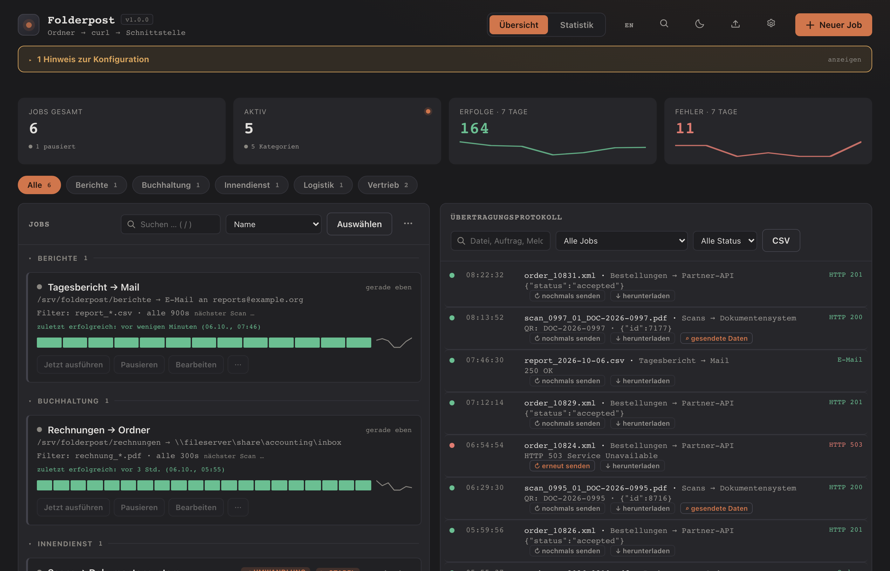 | 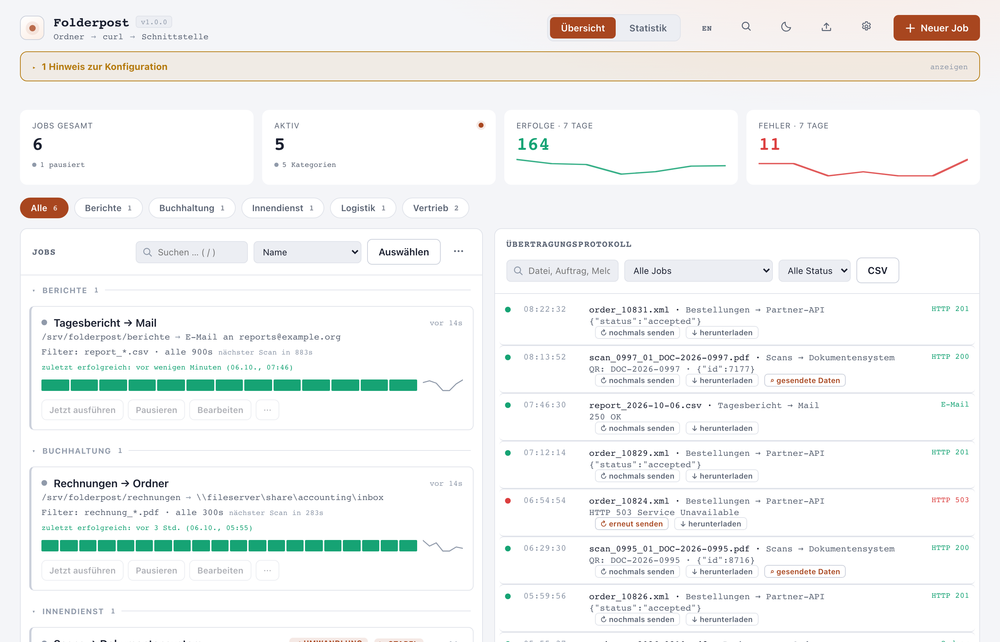 |

## Job-Details

| Dunkel | Hell |
|---|---|
| 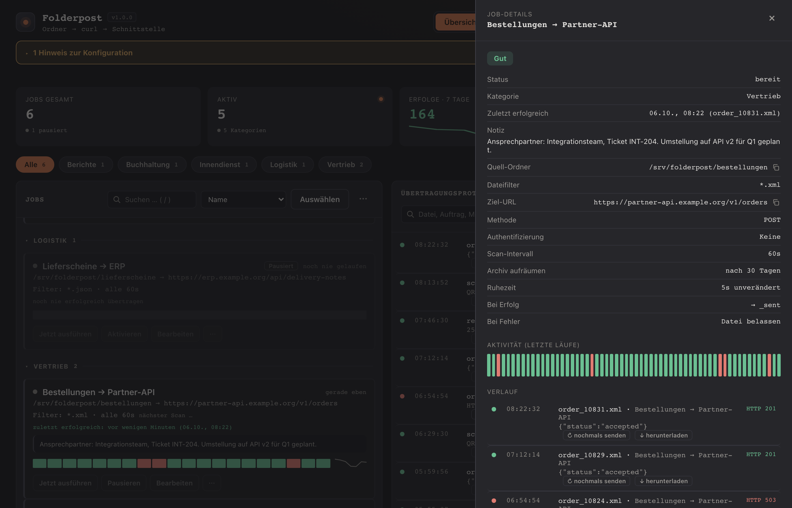 | 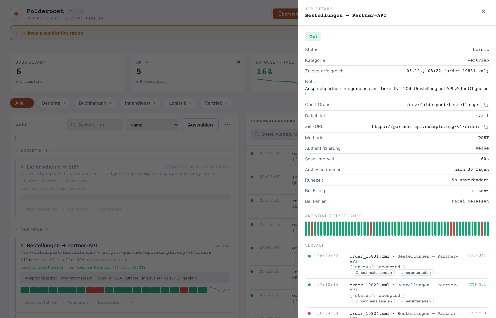 |

## Job-Formular: Stapelscans mit QR-Codes

| Dunkel | Hell |
|---|---|
| 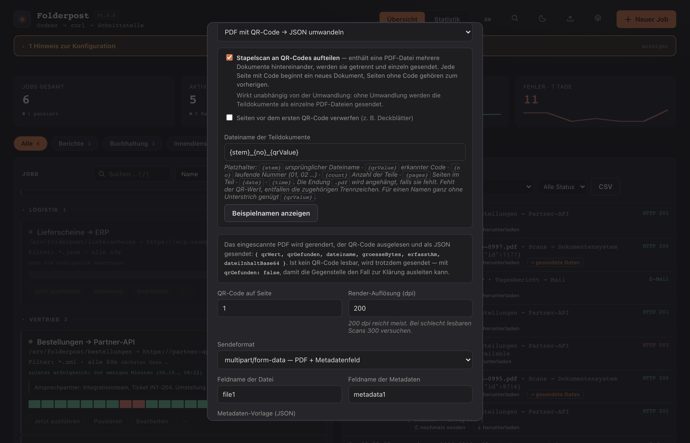 | 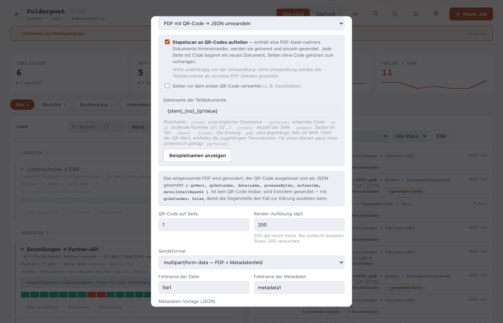 |

## Statistik

| Dunkel | Hell |
|---|---|
| 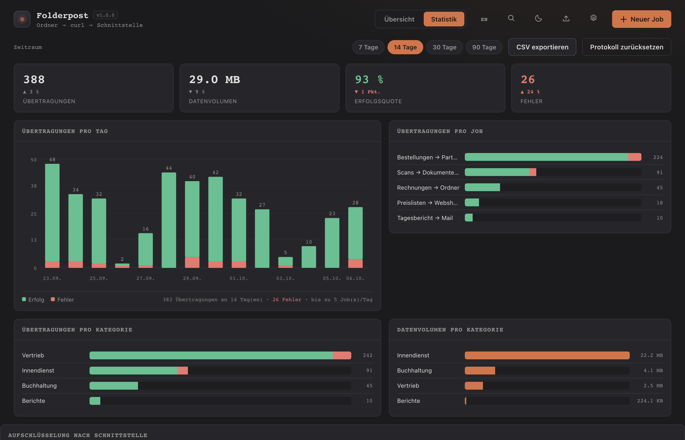 | 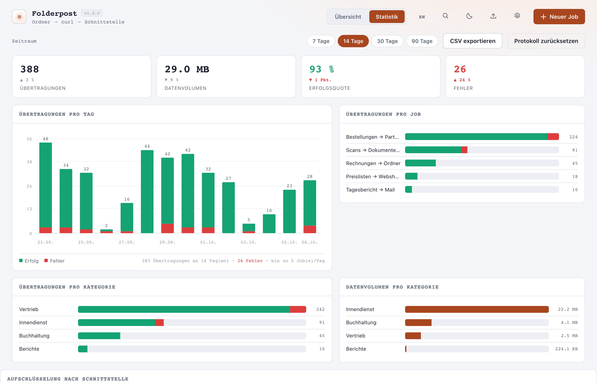 |

## Benachrichtigungen

| Dunkel | Hell |
|---|---|
| 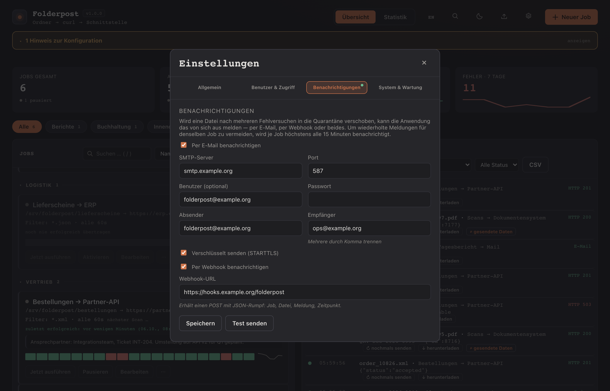 | 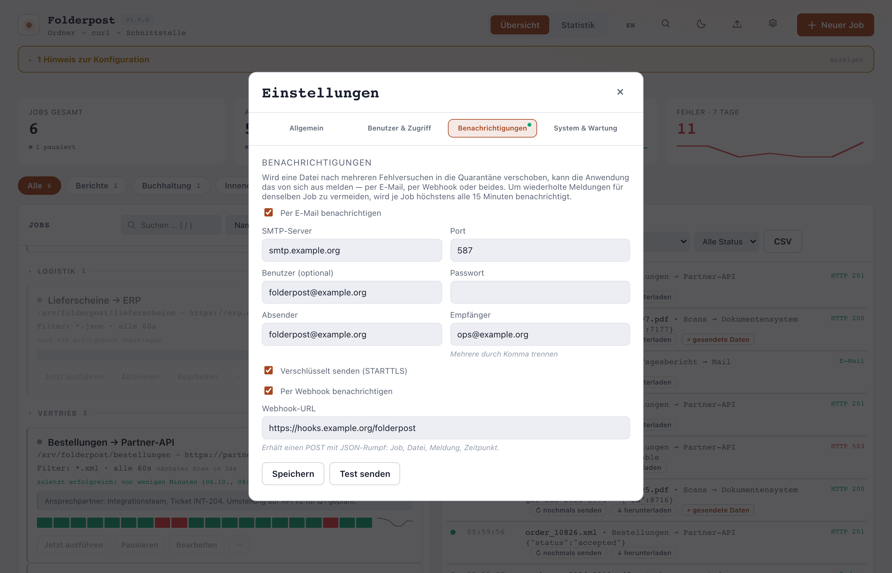 |

## Schnellzugriff (Strg+K)

| Dunkel | Hell |
|---|---|
| 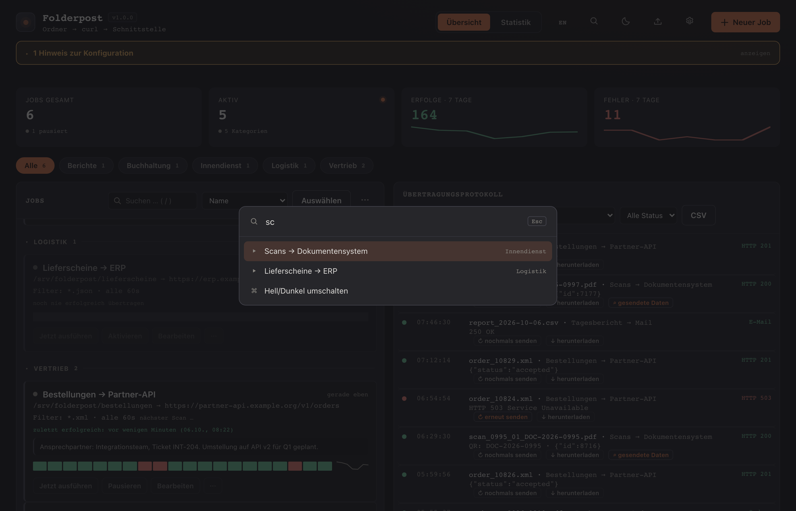 | 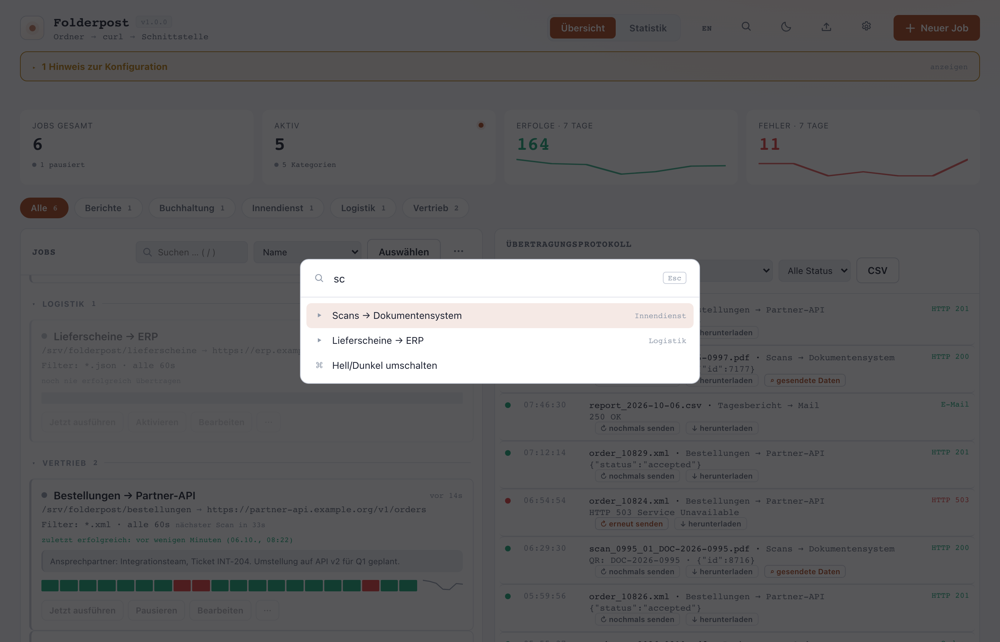 |

## Mobilansicht

| Dunkel | Hell |
|---|---|
| 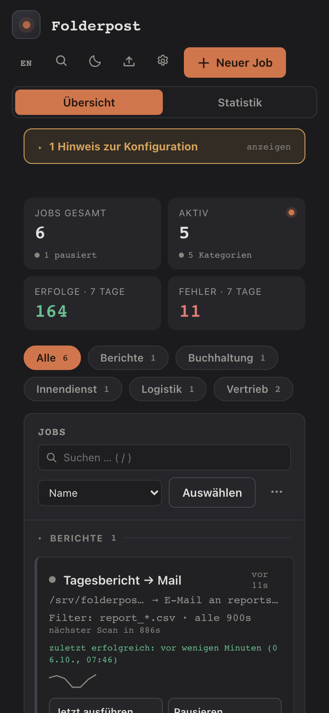 | 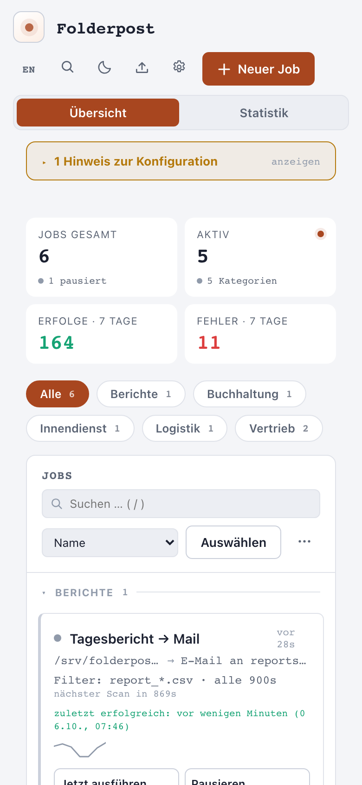 |
