# Screenshots

[Deutsche Fassung](../de/screenshots.md) · [README](../../README.md)

All screenshots were taken with neutral demo data (`tools/demo-data.py`) by `tools/screenshots.py`.

## Overview

| Dark | Light |
|---|---|
| 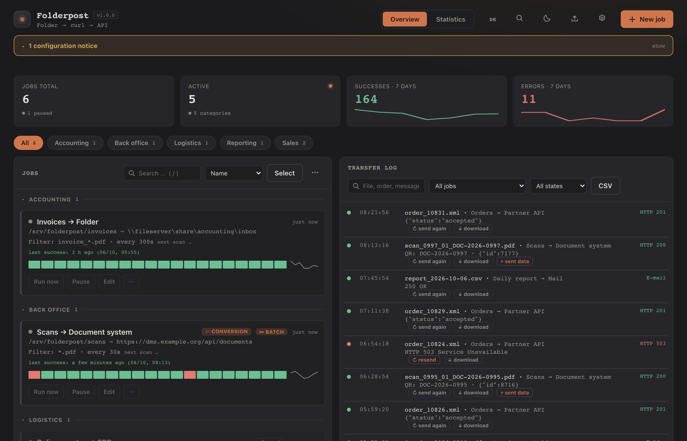 | 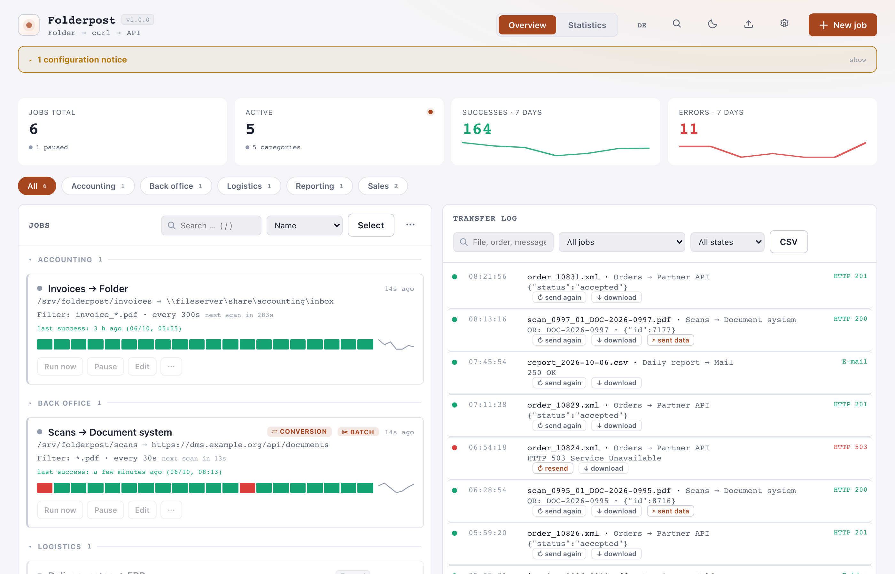 |

## Job details

| Dark | Light |
|---|---|
| 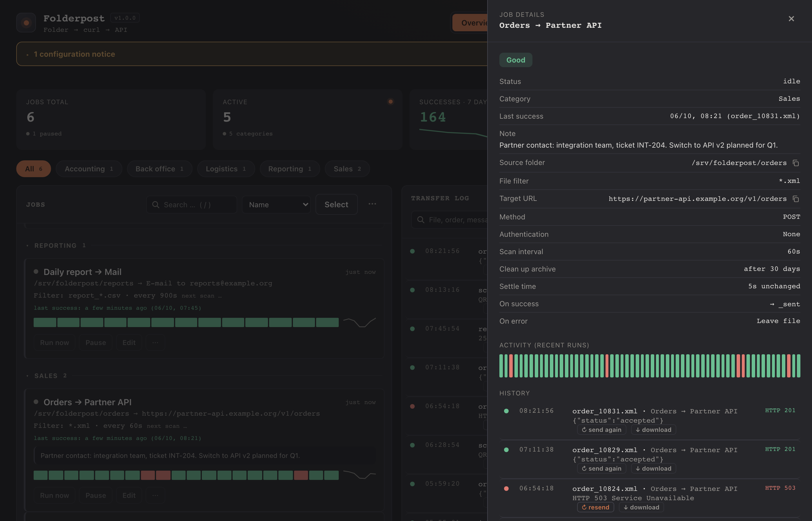 | 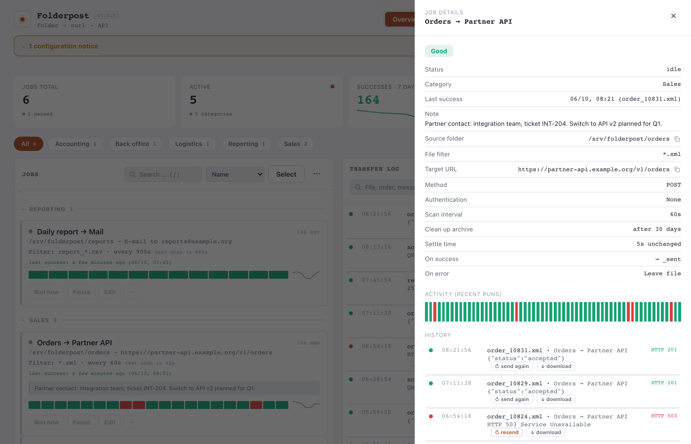 |

## Job form: batch scans with QR codes

| Dark | Light |
|---|---|
| 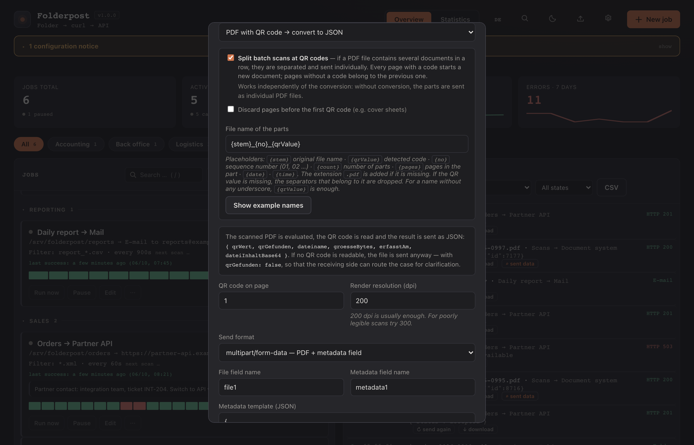 | 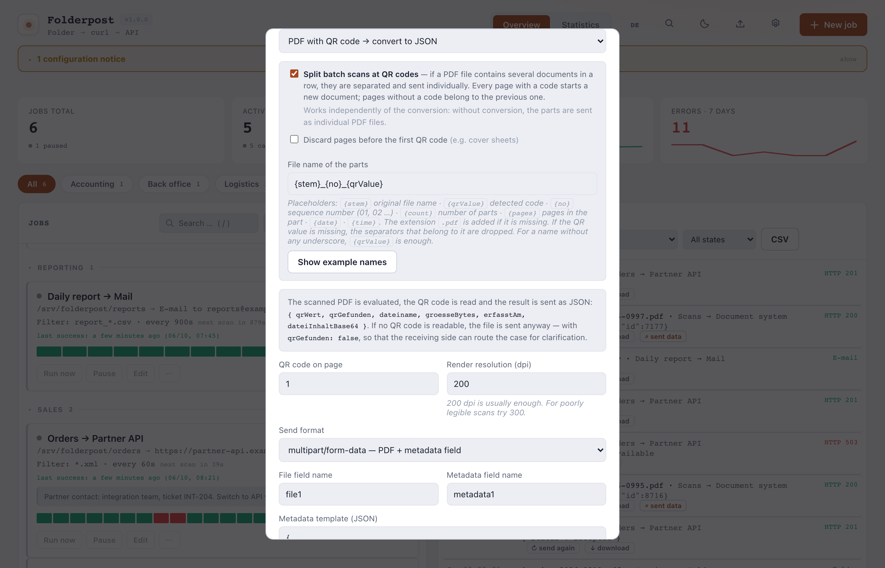 |

## Statistics

| Dark | Light |
|---|---|
| 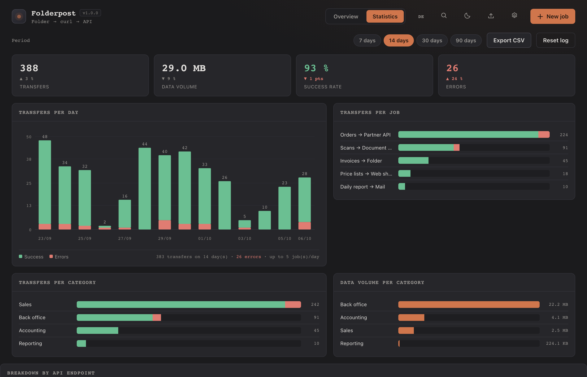 | 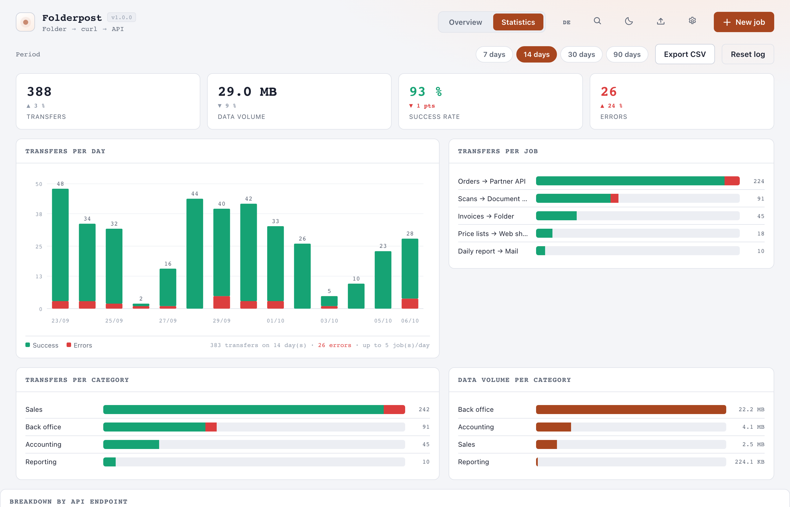 |

## Notifications

| Dark | Light |
|---|---|
| 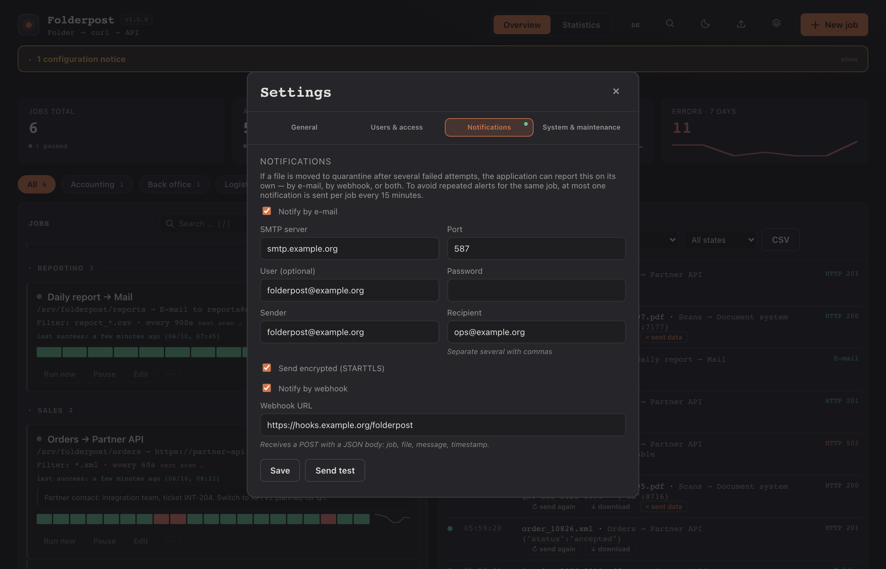 | 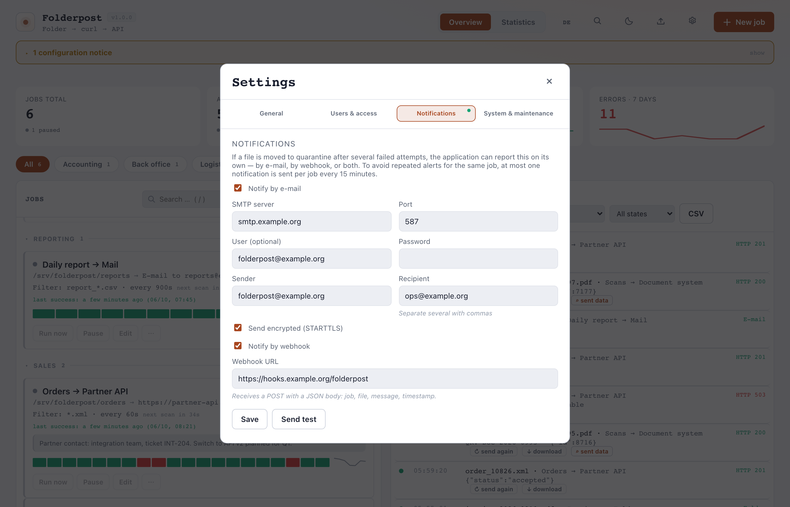 |

## Command palette (Ctrl+K)

| Dark | Light |
|---|---|
| 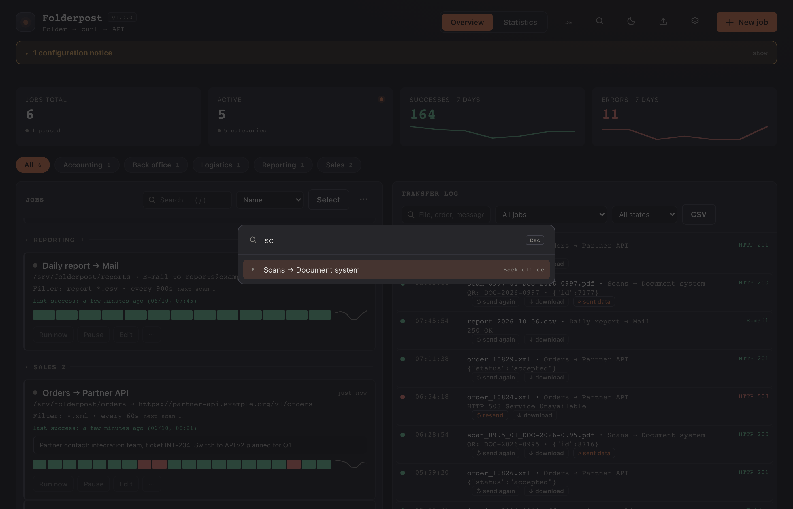 | 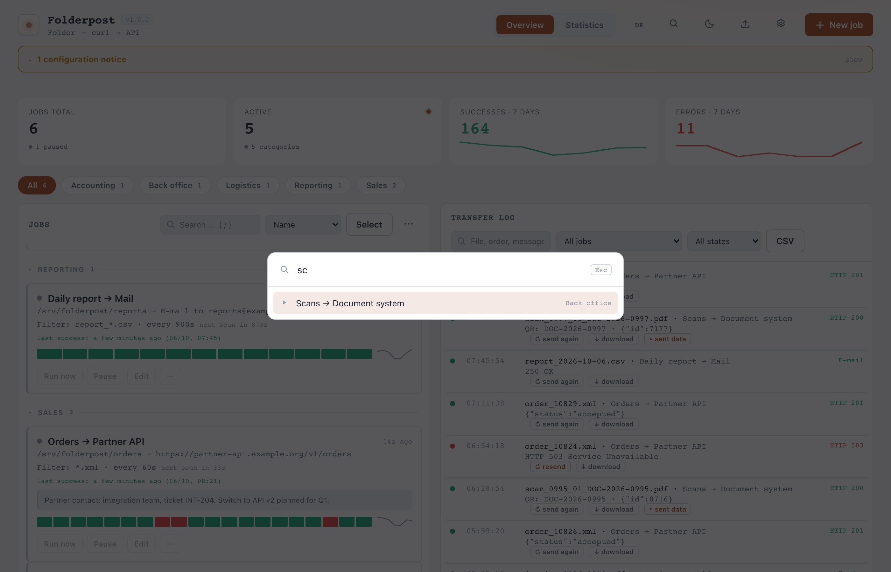 |

## Mobile view

| Dark | Light |
|---|---|
| 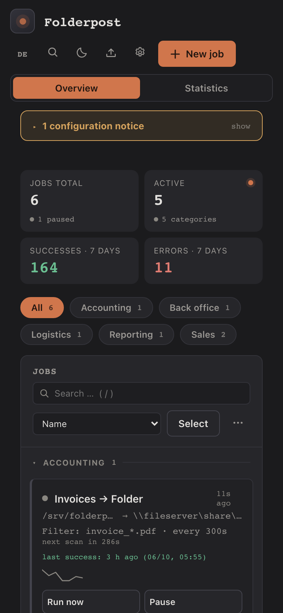 | 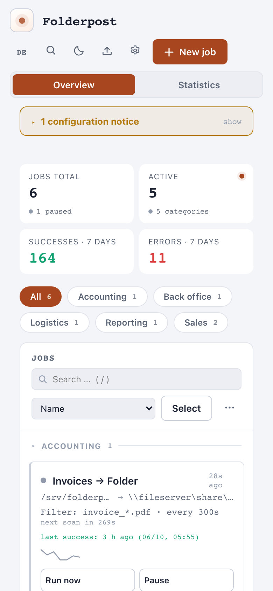 |
